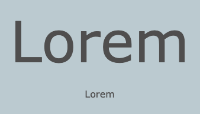

A `<h1>` tag is used to say that this content is the largest header on the page. 
  
The next header tag is `<h2>` used for a lower level title.

Paragraph text can be added using the `
` tag:
  
--- code ---
---
language: html
filename: index.html
line_numbers: false
line_number_start: 1
line_highlights: 2, 7
---
    <header class="border-bottom secondary">
      <h1>Lorem ipsum</h1> 
    </header>
  
    <main>
      <section>
      <h2>Lorem ipsum dolor.</h2>
      
Lorem ipsum dolor sit amet.

      </section>
    </main>

--- /code ---
  
**Tip:** The starter project has custom styles in the `style.css` file to set the fonts used by the `<h1>` , `<h2>` and 
 elements so they match the project fonts palette.
  

  
You can also use the `bigfont` and `hugefont` custom classes included in the starter project:
  
--- code ---
---
language: html
filename: index.html
line_numbers: false
--- 

Lorem

Lorem

--- /code ---
  

