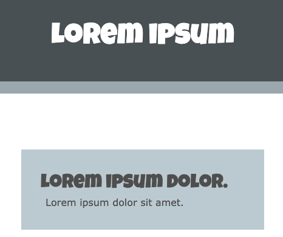

Une balise `<h1>` est utilisée pour indiquer que ce contenu est le plus grand en-tête de la page.

La balise d'en-tête suivante est `<h2>`, utilisée pour un titre de niveau inférieur.

Pour ajouter du texte de paragraphe, utilise la balise `<p>` :

## --- code ---

language: html
filename: index.html
line_numbers: false
line_number_start: 1
line_highlights: 2, 7
----------------------------------------------------------

```
<header class="border-bottom secondary">
  <h1>Lorem ipsum</h1> 
</header>

<main>
  <section>
  <h2>Lorem ipsum dolor.</h2>
  <p>Lorem ipsum dolor sit amet.</p>
  </section>
</main>
```

\--- /code ---

**Astuce :** Le projet de démarrage a des styles personnalisés dans le fichier `style.css` pour définir les polices utilisées par les éléments `<h1>` , `<h2>` et `<p>` de manière à ce qu'elles correspondent à la palette de polices du projet.



Tu peux également utiliser les classes personnalisées `bigfont` et `hugefont` incluses dans le projet de démarrage.

## --- code ---

language: html
filename: index.html
line_numbers: false
--------------------------------------------------------

<p class="hugefont">Lorem</p>
<p class="bigfont">Lorem</p>

\--- /code ---


