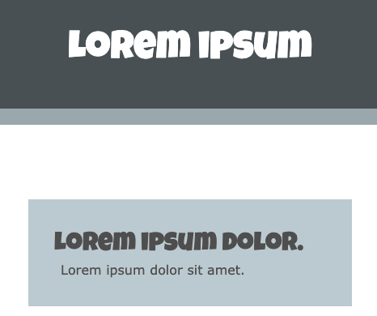
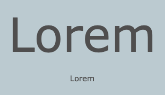

Een `<h1>` tag wordt gebruikt om aan te geven dat deze inhoud de grootste koptekst op de pagina is.

De volgende headertag is `<h2>` en wordt gebruikt voor een titel op een lager niveau.

Om alineatekst toe te voegen, gebruik je de tag `<p>`:

## --- code ---

language: html
filename: index.html
line_numbers: false
line_number_start: 1
line_highlights: 2, 7
----------------------------------------------------------

```
<header class="border-bottom secondary">
  <h1>Lorem ipsum</h1> 
</header>

<main>
  <section>
  <h2>Lorem ipsum dolor.</h2>
  <p>Lorem ipsum dolor sit amet.</p>
  </section>
</main>
```

\--- /code ---

**Tip:** Het startproject heeft aangepaste stijlen in het bestand `style.css` om de lettertypen in te stellen die worden gebruikt door de elementen `<h1>` , `<h2>` en `<p>`, zodat ze overeenkomen met het lettertypepalet van het project.



Je kunt ook de `bigfont` en `hugefont` aangepaste klassen gebruiken die in het startersproject zitten.

## --- code ---

language: html
filename: index.html
line_numbers: false
--------------------------------------------------------

<p class="hugefont">Lorem</p>
<p class="bigfont">Lorem</p>

\--- /code ---


