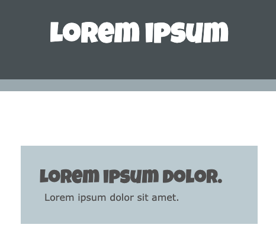
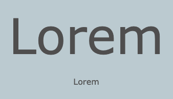

使用 `<h1>` 标签来表示此内容是页面上最大的标题。

下一个标题标签是 `<h2>`，用于较低级别的标题。

要添加段落文本，请使用 `
` 标签：

--- code ---
---
language: html
filename: index.html
line_numbers: false
line_number_start: 1
line_highlights: 2, 7
---
    <header class="border-bottom secondary">
      <h1>Lorem ipsum</h1> 
    </header>
  
    <main>
      <section>
      <h2>Lorem ipsum dolor.</h2>
      
Lorem ipsum dolor sit amet.

      </section>
    </main>

--- /code ---

**提示**：初始项目在 `style.css` 文件中有自定义样式，用于设置 `<h1>` 、 `<h2>` 和 `
` 元素使用的字体，以便它们与项目字体调色板相匹配。

你还可以使用初始项目中包含的 `bigfont` 和 `hugefont` 自定义类。

--- code ---
---
language: html
filename: index.html
line_numbers: false
--- 

Lorem

Lorem

--- /code ---

